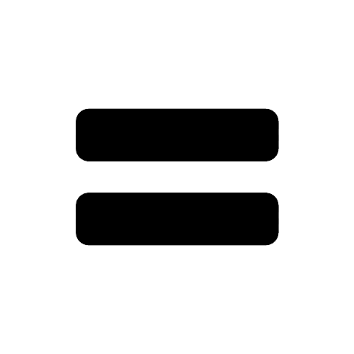
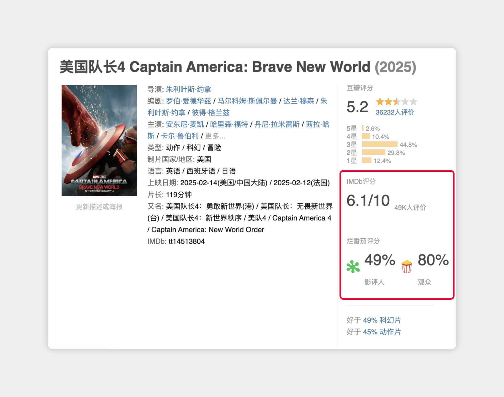
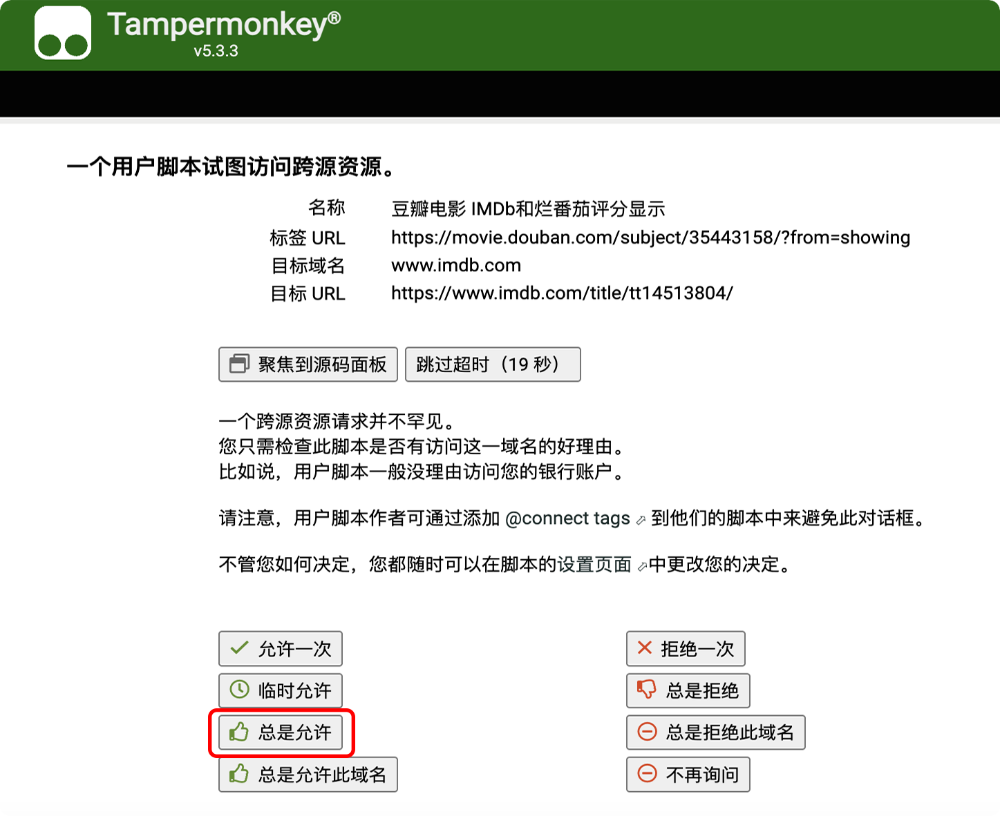
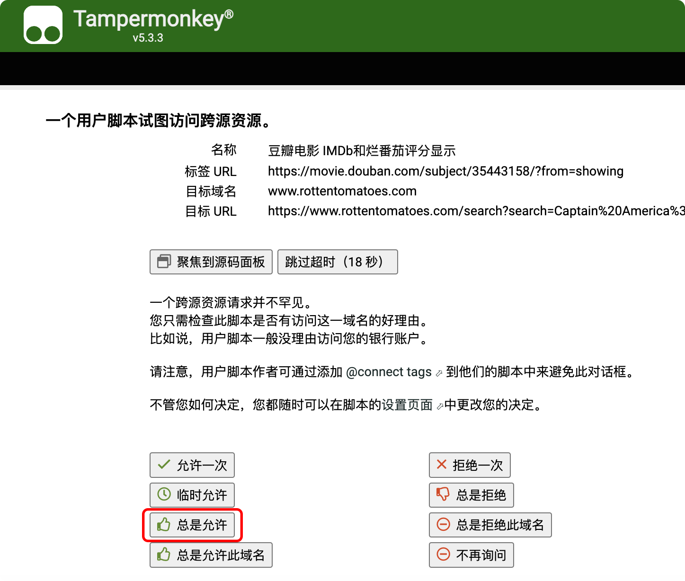

# 豆瓣电影显示IMDb和烂番茄评分插件

在豆瓣电影页面显示对应的IMDb评分和烂番茄评分（影评人，观众）数据。

## 效果展示

## 功能
- 显示IMDb评分和评分人数
- 显示烂番茄专业评分和观众评分
- 点击评分可跳转到对应网站查看详情

## 安装
1. 首先需要安装 [Tampermonkey](https://www.tampermonkey.net/) 浏览器扩展
2. 然后点击 [这里](https://greasyfork.org/zh-CN/scripts/527823-%E8%B1%86%E7%93%A3%E7%94%B5%E5%BD%B1-imdb%E5%92%8C%E7%83%82%E7%95%AA%E8%8C%84%E8%AF%84%E5%88%86%E6%98%BE%E7%A4%BA) 安装脚本

## 使用说明

### 首次使用
首次使用时，脚本会请求访问 IMDb 和烂番茄网站的权限：

  

    
  

  

    
  

  <em>左：IMDb 权限请求 &nbsp;&nbsp;&nbsp;&nbsp; 右：烂番茄权限请求</em>

建议点击"**<ins>总是允许</ins>**"以获得最佳使用体验。如果不小心点击了其他选项，可以在 Tampermonkey 的设置页面中重新授权。

### 使用须知
由于脚本需要从 IMDb 和烂番茄网站获取数据：
- 确保你的网络环境可以访问 IMDb (<ins>www.imdb.com</ins>) 和烂番茄 (<ins>www.rottentomatoes.com</ins>)
- 如果无法访问这些网站，对应的评分将无法显示
- 某些在IMDb上无词条的电影无法显示评分
- 烂番茄评分可能因错误识别电影名称而显示错误

### 关于评分
- 烂番茄图标含义：[About Rotten Tomatoes®](https://www.rottentomatoes.com/about)
- IMDb评分常见问题：[IMDb Ratings FAQ](https://help.imdb.com/article/imdb/track-movies-tv/ratings-faq/G67Y87TFYYP6TWAV?showReportContentLink=false#)

## 兼容性
- Edge 最新版
- Chrome 最新版
- Firefox 最新版
- Safari 最新版

## License
[MIT License](LICENSE)

## 项目地址
